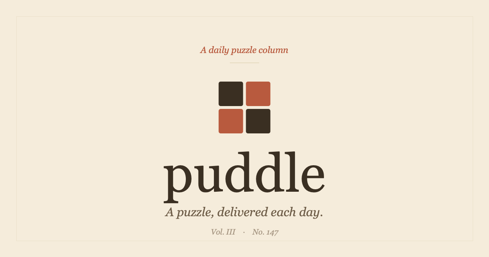

<p align="center">
  <a href="https://solvepuddle.com">
    
  </a>
</p>

<h1 align="center">Puddle</h1>

<p align="center">
  A quiet daily puzzle column. One puzzle a day, no notification spam.
</p>

<p align="center">
  <a href="https://solvepuddle.com"></a>
  <a href="LICENSE"></a>
  
  
  <a href="https://discord.gg/nH3dKXnN4u"></a>
</p>

---

Puddle publishes a single puzzle each day, drawn from six genres — logic, deduction,
quant, sequences, lateral riddles, and wordplay. It keeps an editorial, lamplit
aesthetic and a deliberately calm pace: no timers, no leaderboards shouting at you,
no streak-anxiety mechanics. Solve it, or don't. There's another one tomorrow.

**▸ Play it: [solvepuddle.com](https://solvepuddle.com)**

> This repository is **source-available, not open source.** You're welcome to read
> the code; reuse is not granted. See [Licensing](#licensing).

## Features

- **A daily puzzle across six genres** — logic, deduction, quant, sequences,
  lateral, and wordplay — with worked solutions and graduated hints.
- **Streaks, XP, and levels** — progress that rewards showing up, not speed. Solve
  duration is never shown and never affects XP.
- **A profile heatmap** — a calendar of your solves at a glance.
- **Sign in with Google or Discord** — one account, merged by verified email.
- **Themed volumes** — recurring multi-puzzle arcs with a shared world and cast.
- **Dark mode & accessibility** — a warm dark theme plus high-contrast, cleaner-text,
  and reduce-motion controls, each applied instantly and per device.
- **Discord integration** — a community bot (`/today`, `/stats`, `/leaderboard`), an
  automatic morning post of the day's puzzle, and an embedded Discord **Activity**
  with rich presence.

## Tech stack

| Layer | Choice |
|-------|--------|
| Framework | **Next.js** (App Router) + React |
| Styling | **Tailwind CSS** |
| Auth | **Supabase Auth** — Google + Discord OAuth, account merge by verified email |
| Database | **Supabase** (Postgres) |
| Hosting | **Vercel** (production + per-PR previews) |
| Integrations | Discord bot, embedded Activity, and rich presence |

## Running locally

**Prerequisites:** Node.js 20+.

```bash
cd app
npm install
cp .env.local.example .env.local   # then fill in the values
npm run dev
```

The app runs at `http://localhost:3000`. Point the credentials in `app/.env.local`
at a **staging** Supabase project, never production. See
[CONTRIBUTING.md](CONTRIBUTING.md) for the full environment and workflow guide.

## Project layout

```
app/                  Next.js application
  src/
    app/              Routes (App Router)
    components/       Shared UI components
    lib/
      db/             Supabase query helpers
      supabase/       Client / server Supabase instances
      discord/        Bot, interactions, REST helpers
      utils/          Dates, XP math
    types/            Shared TypeScript types
  scripts/            CLI utilities (puzzle sync, command registration)
  supabase/
    migrations/       Ordered SQL schema + seed
  public/             Static assets

puzzles/              Puzzle JSON source files (the content source of truth)
```

## Puzzle content

Puzzles are JSON files in [`puzzles/`](puzzles/) — one per issue, scheduled ahead of
time by `date_active`. They are the **source of truth**: the database is synced *from*
them and never edited directly. `puzzles/template.json` documents the shape.

Files reach the database two ways:

- **Automatically** — a daily Vercel cron (`/api/cron/sync-puzzles`) pulls
  `puzzles/*.json` from `main` and upserts them.
- **Immediately** — `cd app && npm run sync-puzzles` (add `-- --dry-run` to preview).

The sync validates every file first and refuses to touch the database if any is
malformed, so a bad puzzle can't go live.

## Database

Core tables: `users`, `puzzles`, `solves`, `user_settings`, `submissions`,
`anon_solves`. The schema is built up by the ordered SQL files in
[`app/supabase/migrations/`](app/supabase/migrations/) (starting at `001_schema.sql`),
applied by hand in the Supabase SQL editor. The migration discipline that prevents
outages is described in [CONTRIBUTING.md](CONTRIBUTING.md).

## Contributing

Puddle follows production-grade practices — trunk-based branches, pull requests,
three environments, and SemVer releases. **Never commit to `main` directly.** Start
with **[CONTRIBUTING.md](CONTRIBUTING.md)**.

Release notes are published as [GitHub Releases](https://github.com/rakdcolon/puddle/releases).

## Security

Found a vulnerability? Please report it privately — see [SECURITY.md](SECURITY.md).
Do not open a public issue for security reports.

## Community & support

Questions, ideas, or just want to talk puzzles? Join the
**[Puddle Discord](https://discord.gg/nH3dKXnN4u)**. See [SUPPORT.md](SUPPORT.md) for
all the ways to get help.

## Licensing

Puddle is **proprietary and source-available**. The code is published for
transparency and reference; no rights to use, copy, modify, or redistribute it are
granted. The "Puddle" name, logo, and puzzle content are not licensed for reuse.
See [LICENSE](LICENSE) for the full terms and licensing-inquiry contact.

<p align="center"><sub>© 2026 Rohan Karamel. All rights reserved.</sub></p>
